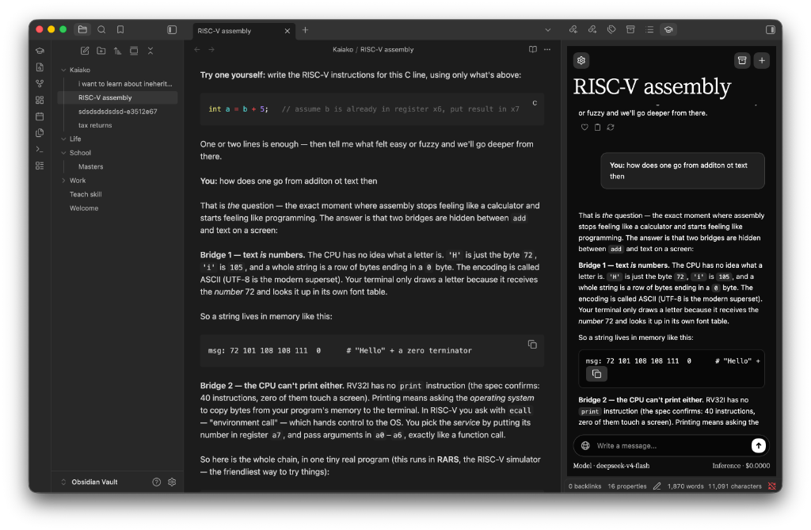
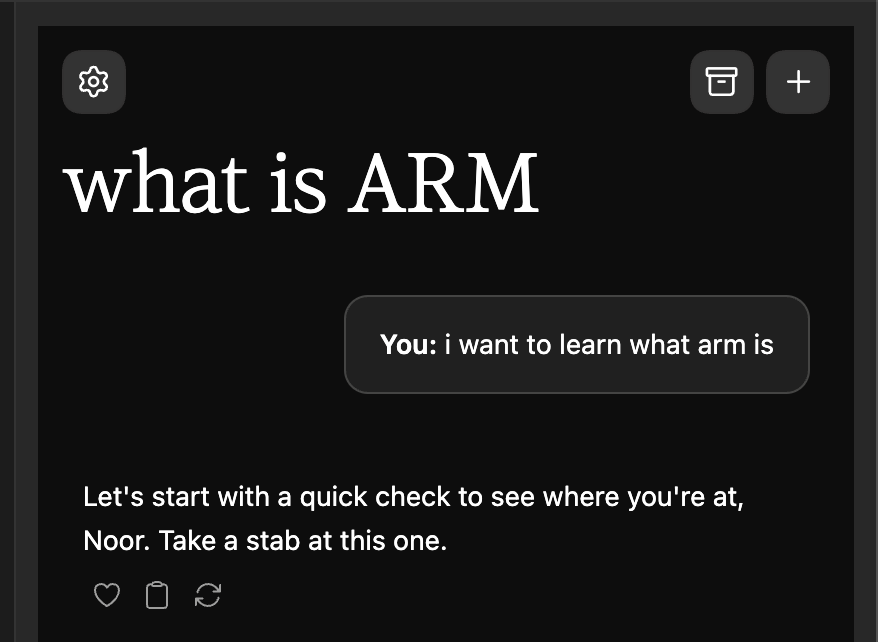
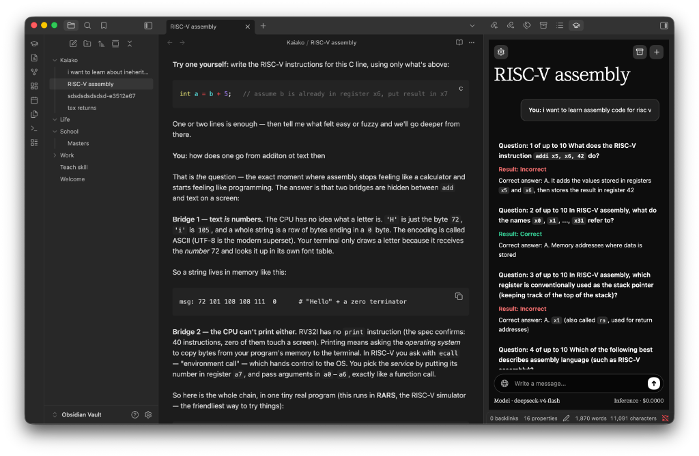
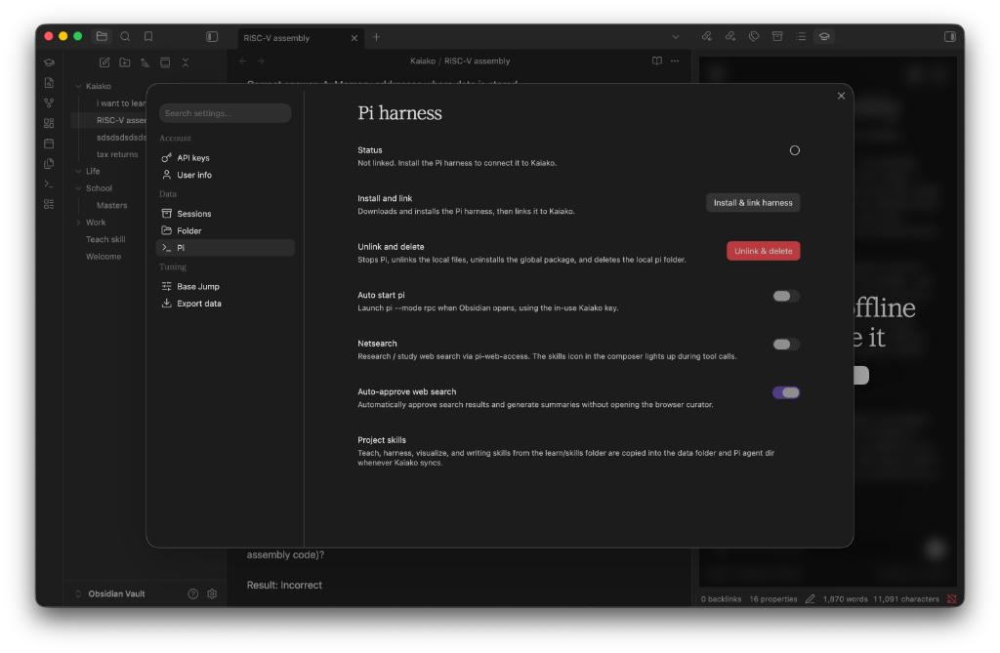

# Kaiko — Adaptive AI Learning Companion for Obsidian

[](https://github.com/aditauqir/kaiko/releases/tag/Kaiko-1.0.0)
[](https://opensource.org/licenses/0-BSD)
[](https://obsidian.md)
[](https://github.com/aditauqir/kaiko.git)

**Kaiko** (from the Māori *kaiako*, meaning teacher or instructor) is an autonomous, psychometrically-calibrated adaptive learning companion for [Obsidian](https://obsidian.md).

Unlike generic AI study chat plugins that either lecture continuously or generate isolated quizzes, Kaiko integrates a local [Pi coding agent](https://github.com/earendil-works/pi-coding-agent) daemon with a formal **Rasch 1-Parameter Logistic Item Response Theory (IRT)** psychometric engine. It actively diagnoses conceptual understanding through calibrated multiple-choice diagnostics (CAT), derives your latent ability ($\theta$), and scaffolds personalized instruction directly into your local Markdown notes with zero data loss.

<p align="center">
  
</p>

---

## Table of Contents

- [Overview](#overview)
- [How It Works: The Three-Phase Learning Loop](#how-it-works-the-three-phase-learning-loop)
  - [1. Goal Capture (`need_goal`)](#1-goal-capture-need_goal)
  - [2. Adaptive Diagnostic (`diagnostic`)](#2-adaptive-diagnostic-diagnostic)
  - [3. Scaffolded Instruction (`teaching`)](#3-scaffolded-instruction-teaching)
- [Psychometric Knowledge Engine](#psychometric-knowledge-engine)
- [Key Features](#key-features)
  - [Interactive MCQ Approval Cards](#interactive-mcq-approval-cards)
  - [Ambient Thinking Orb](#ambient-thinking-orb)
  - [Live Typewriter Reveal and Focus Mode](#live-typewriter-reveal-and-focus-mode)
  - [Vault-Native Markdown Sync](#vault-native-markdown-sync)
  - [Active Study Clock and Inactivity Detection](#active-study-clock-and-inactivity-detection)
  - [Visual Maker Subagents (Mermaid and SVG)](#visual-maker-subagents-mermaid-and-svg)
  - [Psychometric CSV Data Export](#psychometric-csv-data-export)
- [Prerequisites](#prerequisites)
- [Installation Guide](#installation-guide)
  - [Method 1: Install from GitHub Releases (Recommended)](#method-1-install-from-github-releases-recommended)
  - [Method 2: Install Manually from Source](#method-2-install-manually-from-source)
  - [Install the Pi Agent Harness](#install-the-pi-agent-harness)
- [Getting Started & Onboarding](#getting-started--onboarding)
- [Configuration Reference](#configuration-reference)
- [Supported Model Providers](#supported-model-providers)
- [Repository Structure](#repository-structure)
- [Development Protocol](#development-protocol)
- [Credits & Attribution](#credits--attribution)
- [License](#license)

---

## Overview

Traditional AI study assistants either lecture passively or quiz aimlessly. Kaiko bridges this gap:

- **Sidebar Companion**: Embedded directly as a native Obsidian sidebar view with fluid typography, responsive layout, and LaTeX math rendering.
- **Psychometrically Calibrated**: Applies Rasch 1PL Item Response Theory with Bayesian Maximum A Posteriori (MAP) estimation to track knowledge from 0 to 100 points.
- **Base Jump Pedagogical Entry**: Scaffolds instruction starting below your tested ability ceiling, locking in foundational principles before progressing.
- **Vault First**: Automatically creates and synchronizes Markdown notes (`Kaiko/<Topic>-<ID>.md`) containing clean chat transcripts, diagnostic logs, and YAML metadata.
- **Local Agent Execution**: Communicates via bidirectional JSON-RPC over stdio with the `pi` coding agent daemon, executing autonomous research, subagents, and tools on your machine.

---

## How It Works: The Three-Phase Learning Loop

```
┌───────────────────────────────────────────────────────────┐
│                 1. Goal Capture (need_goal)               │
│  Learner defines target capability → Agent confirms goal  │
└─────────────────────────────┬─────────────────────────────┘
                              │
                              ▼
┌───────────────────────────────────────────────────────────┐
│               2. Adaptive Diagnostic (diagnostic)         │
│  Interactive MCQs (max 10) → Rasch 1PL MAP theta update   │
│  Stops on SE(θ) ≤ 0.50, near-floor misses, or 10 items    │
└─────────────────────────────┬─────────────────────────────┘
                              │
                              ▼
┌───────────────────────────────────────────────────────────┐
│               3. Scaffolded Instruction (teaching)        │
│  Teaching entry = Knowledge score − Base Jump offset      │
│  Unconditional truths first → Motivated discovery upward  │
└───────────────────────────────────────────────────────────┘
```

### 1. Goal Capture (`need_goal`)
Before lecturing or testing begins, Kaiko ensures a concrete capability goal is established (e.g., *"understand Docker networking"*, *"derive backpropagation"*, *"build a React hook"*). If you request a **smoke test** or **diagnostic**, Kaiko immediately captures the topic and launches the diagnostic assessment.

<p align="center">
  
</p>

### 2. Adaptive Diagnostic (`diagnostic`)
Once a goal is confirmed, Kaiko launches a Computerized Adaptive Test (CAT):
- Emits clean, single-question multiple-choice prompts targeting your estimated ability.
- Dynamically adjusts question difficulty in logit units ($b_i$) based on previous responses.
- Computes your latent ability ($\theta$) and maps it to a 0–100 point scale.
- Halts adaptively when standard error $\text{SE}(\theta) \le 0.50$, near-floor failure is detected, or the 10-question ceiling is reached.

<p align="center">
  
</p>

### 3. Scaffolded Instruction (`teaching`)
Rather than teaching at your diagnostic limit, Kaiko applies a **Base Jump** offset to start instruction below your ceiling:
- **Low sensitivity**: 10 points below diagnosed score.
- **Medium sensitivity (default)**: 25 points below diagnosed score.
- **High sensitivity**: 40 points below diagnosed score.

Instruction builds upward from foundational, unconditional truths toward the target capability without hand-waving.

---

## Psychometric Knowledge Engine

Kaiko implements a formal Item Response Theory (IRT) engine (`kaiako/src/knowledge.ts`):

- **Item Response Function (Rasch 1PL)**:
  $$P(U_{ni} = 1 \mid \theta_n, b_i) = \frac{1}{1 + e^{-(\theta_n - b_i)}}$$
  where $\theta_n$ represents learner ability and $b_i$ represents item difficulty in logits (clamped to $[-2.5, +2.5]$).

- **Newton–Raphson MAP Ability Estimation**:
  $$\theta^{(t+1)} = \theta^{(t)} - \frac{f'(\theta^{(t)})}{f''(\theta^{(t)})}$$
  Using a standard normal prior $\theta \sim \mathcal{N}(0, 1)$, MAP estimation resolves mathematical divergence issues inherent in standard Maximum Likelihood Estimation (MLE) for all-correct or all-incorrect streaks.

- **Fisher Information & Standard Error**:
  $$\mathcal{I}(\theta) = 1 + \sum_{i=1}^{k} P_i(\theta) [1 - P_i(\theta)], \quad \text{SE}(\theta) = \frac{1}{\sqrt{\mathcal{I}(\theta)}}$$

- **Stopping Rules**:
  - **SE Stop**: $\text{SE}(\theta) \le 0.50$ after at least 4 items.
  - **Floor Stop**: 3 misses with $\theta \le -1.2$ logits.
  - **Ceiling Stop**: Maximum of 10 diagnostic items reached.

- **Knowledge Score Conversion**:
  $$\text{knowledge\_score} = \operatorname{clamp}(50 + 20\theta, 0, 100)$$

---

## Key Features

### Interactive MCQ Approval Cards
Diagnostic questions render as clean interactive cards (`kaiako/src/approval-card.ts`):
- Single-click radio selection with immediate response dispatch.
- Alternative explanation text input ("Something else...").
- "I don't know" button to signal unfamiliarity without penalizing score with wild guesses.
- Robust Markdown parser supporting fenced blocks, HTML comments, and standard markdown lists.

### Ambient Thinking Orb
A centered canvas element (`kaiako/src/thinking-orb.ts`) hovers above the input bar:
- Real-time color signatures: **Goal Setting** (warm tone), **Smoke Testing / Diagnostic** (violet/blue), and **Teaching** (emerald/amber).
- Harmonic pulse animation during model reasoning and tool execution.

### Live Typewriter Reveal and Focus Mode
- Streaming responses render character-by-character with typewriter pacing (`kaiako/src/streaming-text.ts`).
- Focus mode with ambient background blur and contrast optimization for both light and dark Obsidian themes.

### Vault-Native Markdown Sync
- Every conversation automatically writes to `Kaiako/<Topic>-<ID>.md`.
- Persists clean diagnostic history, questions, answers, and frontmatter telemetry.
- Recovers pending questions across Obsidian restarts with zero state desynchronization.

### Active Study Clock and Inactivity Detection
- Tracks true study duration in seconds and minutes.
- Features an automatic 120-second idle detection mechanism that freezes the timer when you step away.

### Visual Maker Subagents (Mermaid and SVG)
When visual diagrams aid comprehension, the agent automatically summons specialized subagents (`mermaid-maker` or `svg-maker`) to generate, render, visually verify, and embed SVG or Mermaid graphics into your note.

### Psychometric CSV Data Export
The settings modal provides a one-click **Export data** feature generating research-ready CSV analytics covering session durations, latent ability ($\theta$), standard errors, diagnostic accuracy, and item difficulties.

---

## Prerequisites

- **Obsidian**: Version 1.8.0 or higher.
- **Node.js**: Version 18.0.0 or higher (for building from source or running the local Pi daemon).
- **Pi Coding Agent**: Global npm package `@earendil-works/pi-coding-agent`.
- **LLM API Key**: At least one key (Anthropic, OpenAI, Google Gemini, OpenRouter, DeepSeek, or DashScope).

---

## Installation Guide

### Method 1: Install from GitHub Releases (Recommended)

Follow these quick steps to install Kaiko in under 1 minute:

1. **Download the release**:
   Visit the official release page: 👉 **[https://github.com/aditauqir/kaiko/releases/tag/Kaiko-1.0.0](https://github.com/aditauqir/kaiko/releases/tag/Kaiko-1.0.0)**<br>
   Download **`Kaiko-1.0.0.zip`** from the Assets section (or download `main.js`, `manifest.json`, and `styles.css` individually).

2. **Locate your Obsidian vault plugins directory**:
   - **macOS**: `~/Documents/<Your-Vault>/.obsidian/plugins/` *(press `Cmd + Shift + .` to show hidden folders in Finder)*
   - **Windows**: `C:\Users\<Username>\Documents\<Your-Vault>\.obsidian\plugins\`
   - **Linux**: `/home/<username>/<Your-Vault>/.obsidian/plugins/`

3. **Extract into a `kaiko` folder**:
   - Inside `.obsidian/plugins/`, create a folder named `kaiko`.
   - Extract `Kaiko-1.0.0.zip` (or move the 3 files) into this folder so the structure is:
     ```
     <Your-Vault>/.obsidian/plugins/kaiko/
     ├── main.js
     ├── manifest.json
     └── styles.css
     ```

4. **Enable Kaiko in Obsidian**:
   - Open **Obsidian Settings** (`Cmd + ,` or `Ctrl + ,`) → **Community plugins**.
   - Ensure **Restricted mode** is turned **OFF**.
   - Click the refresh circle icon (**Reload plugins**).
   - Find **Kaiko** under *Installed plugins* and toggle it **ON**.
   - Click the new **graduation cap icon** in Obsidian's left ribbon to start learning!

---

### Method 2: Install Manually from Source

To clone and compile Kaiko directly from GitHub origin:

1. **Clone the repository**:
   ```bash
   git clone https://github.com/aditauqir/kaiko.git
   cd kaiko/learn/kaiako
   ```

2. **Install dependencies and build**:
   ```bash
   npm install
   npm run build
   ```
   *Tip: To build and create the release zip package in one command, run `npm run package`.*

3. **Link or copy into your Obsidian vault**:
   ```bash
   # Define your vault plugin path
   export VAULT_PLUGIN_DIR="/path/to/YourVault/.obsidian/plugins/kaiko"
   mkdir -p "$VAULT_PLUGIN_DIR"

   # Copy the compiled bundle, manifest, and styles
   cp main.js manifest.json styles.css "$VAULT_PLUGIN_DIR/"
   ```

4. **Enable in Obsidian**:
   - Open **Obsidian Settings** → **Community plugins**.
   - Reload plugins and enable **Kaiko**.

---

### Install the Pi Agent Harness

Kaiko uses the Pi coding agent harness to coordinate reasoning, web search, and subagents:

```bash
npm install -g --ignore-scripts @earendil-works/pi-coding-agent
```

*Note: You can also click the **Install Pi harness** button inside the Kaiko settings or the initial onboarding screen.*

---

## Getting Started & Onboarding

1. Click the **graduation cap icon** in Obsidian's left ribbon to open the Kaiko sidebar.
2. The **Onboarding Wizard** will walk you through:
   - **AI Provider**: Choose Anthropic, OpenAI, Gemini, DeepSeek, or OpenRouter.
   - **API Key**: Enter your API key (validated with a live ping).
   - **Learner Profile**: Set your preferred name and background context.
   - **Data Directory**: Select where local agent skills and session metadata are stored.
3. Once configured, type your goal or simply enter:
   - `smoke test on python`
   - `teach me docker`
   - `test my knowledge on quantum computing`
   - `run a smoke test`
4. The adaptive diagnostic will present its first interactive question immediately!

---

## Configuration Reference

Open Kaiko settings via the gear icon in the top header or through **Obsidian Settings → Kaiko**:

<p align="center">
  
</p>

- **Account**:
  - Configure and test API keys for all providers.
  - Customize learner identity, experience level, and pronouns.
- **Data & Process**:
  - View, resume, or delete learning sessions.
  - Auto-start local Pi harness on Obsidian launch.
  - Toggle live web search capabilities.
- **Tuning**:
  - **Base Jump Level**: Adjust whether instruction starts 10, 25, or 40 points below your diagnosed ceiling.
  - **Export Data**: Download session metrics and psychometric records to CSV.

---

## Supported Model Providers

| Provider | Default Model | Environment Variable | Recommended Use |
| :--- | :--- | :--- | :--- |
| **Anthropic Claude** | `claude-3-7-sonnet-latest` | `ANTHROPIC_API_KEY` | Deep pedagogical reasoning & tool use |
| **OpenAI** | `gpt-4o` | `OPENAI_API_KEY` | Structured output & rapid instruction |
| **Google Gemini** | `gemini-2.5-flash` | `GEMINI_API_KEY` | Low-latency streaming & broad knowledge |
| **DeepSeek** | `deepseek-chat` | `DEEPSEEK_API_KEY` | Cost-effective technical tutoring |
| **OpenRouter** | `anthropic/claude-3.5-sonnet` | `OPENROUTER_API_KEY` | Flexible multi-model routing |
| **Qwen Cloud** | `qwen-plus` | `DASHSCOPE_API_KEY` | Multilingual & technical reasoning |

---

## Repository Structure

```
learn/
├── README.md                      # Primary project documentation
├── project_desc                   # Resume guide and engineering highlights
├── project_desc.md                # Formatted markdown resume guide
├── assets/                        # Documentation screenshots and demo media
│   ├── demo-instruction-view.png  # Live instruction and synchronized note
│   ├── demo-adaptive-diagnostic.png # Computerized adaptive test (CAT)
│   ├── demo-goal-capture.png      # Serif typography and goal capture
│   └── demo-harness-settings.png  # Pi agent harness settings panel
├── releases/                      # Packaged release distribution files
│   ├── Kaiko-1.0.0.zip            # Obsidian plugin zip bundle
│   ├── main.js                    # Compiled plugin bundle
│   ├── manifest.json              # Plugin manifest
│   └── styles.css                 # CSS stylesheets
├── kaiako/                        # Obsidian plugin source code
│   ├── manifest.json              # Plugin manifest (id: "kaiko")
│   ├── package.json               # Dependencies and packaging scripts
│   ├── esbuild.config.mjs         # Production & development bundler
│   ├── styles.css                 # Sidebar and card UI styles
│   └── src/
│       ├── main.ts                # Plugin entrypoint and ribbon command
│       ├── kaiako-view.ts         # Sidebar view, chat lifecycle, turn mounting
│       ├── approval-card.ts       # Interactive MCQ DOM component
│       ├── mcq.ts                 # Markdown MCQ parsing, regex, validation
│       ├── knowledge.ts           # Rasch 1PL IRT engine and MAP estimation
│       ├── goal.ts                # Goal and smoke test regex extraction
│       ├── harness-prompt.ts      # Multi-phase agent prompting logic
│       ├── pi.ts                  # Bidirectional JSON-RPC process manager
│       ├── session-activity.ts    # 120s idle-aware active study timer
│       ├── export-data.ts         # Psychometric CSV export pipeline
│       └── settings-modal.ts      # Multi-tab configuration modal
├── extensions/                    # Pi agent companion extensions
├── skills/                        # Curated Pi skills (teach, visualize, harness)
└── agents/                        # Visual maker subagents (Mermaid & SVG)
```

---

## Development Protocol

To develop or contribute to Kaiko:

1. Clone `https://github.com/aditauqir/kaiko.git`
2. Work on the `feature` branch.
3. Verify builds with `npm run build` in `kaiako/`.
4. Package production releases using `npm run package`.

---

## Credits & Attribution

- **Upstream Origin**: Kaiko originated as a fork of [amosblomqvist/learn](https://github.com/amosblomqvist/learn.git) created by [Eero Alvar](https://github.com/amosblomqvist).
- Special thanks to [Eero Alvar](https://github.com/amosblomqvist) for foundational concepts, initial scaffolding, and early architecture of the learning system.

---

## License

This project is licensed under the [0-BSD License](file:///Users/aditauqir/Code/zirn_reprise/learn/kaiako/package.json).
Developed with ❤️ by **Zirn Labs**.
